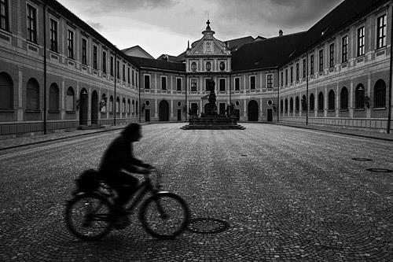
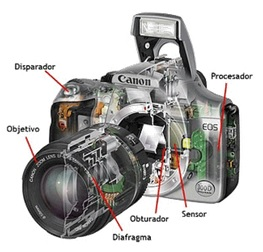
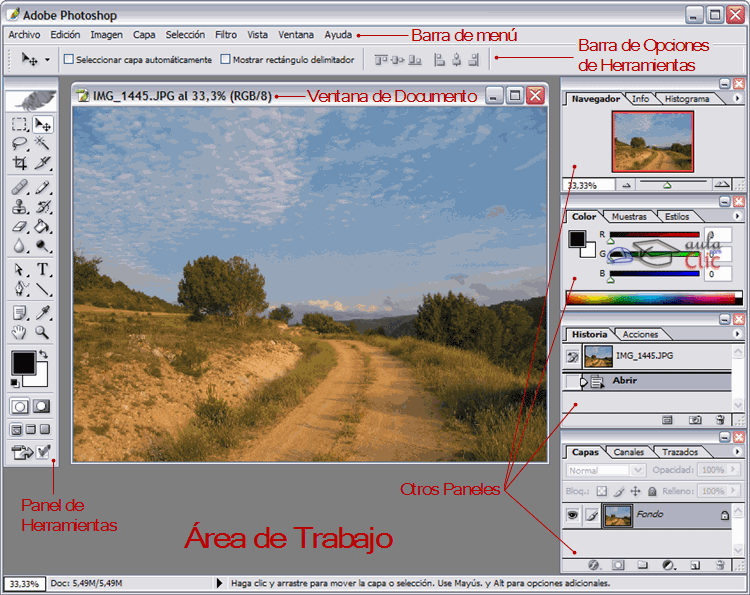

% Estructura del curso
% Alicia Contreras Rico
% 2019

# Sección I: La fotografía I

## Estudio

Se estudiará con la **presentación de HTML5 con reveal.js**

## Introducción

* Historia de la fotografía 

{ width=40% }\       

## La cámara de fotos 

* Qué es una cámara de fotos 
* Partes de la cámara

{width=40%}

## Tipos de cámaras 

* **Compacta**
* **Réflex**  

## La exposición: abertura del diafragma y velocidad de obturación

- *Abertura de diagragma*
- *Velocidad de obturación*

\centering   
{width=30%}\  

## Selector de modos

- Modo automático
- Modo semiautomático
- Modo manual
- Modo vídeo

## Sensor de la imagen

- Qué es el sensor
- Tecnología de los sensores: *CCD y Super CCD, CCD RGBE, CMOS, Foveon X3*
- Puedes ampliar información [aquí](https://www.blogdelfotografo.com/tipos-caracteristicas-ventajas-sensores-camaras-fotos/)

## Objetivos fotográficos

* Qué es un objetivo fotográfico
* Características
* Partes de los objetivos

# Sección II: La fotografía II

## Estudio

Esta parte se estudiarán los conceptos relacionados con la luz, con unos **apuntes en formato EPUB**

## Propiedades de la luz
 
 **Dirección** Si viene de arriba es natural y de abajo no natural 
 **Intensidad** Si intensidad suficiente de luz para darle la oportunidad de captar la escena con la posición correcta  
 **Calidad de la luz** Cuanto más pequeña sea la fuente de luz, más espectacular o dura será la luz que produce. 
 **Temperatura** Cuando la temperatura de la luz tiende hacia el lado naranaja, produce en el espectador un sentido cálido. 

## Aspectos de la luz que se van a estudiar I      

1. Cómo podemos controlar la luz.   
	- La exposición correcta
	- El modo automático y el manual
	- Velocidad y movimiento
	- Abertura y profundidad de campo
	- La sensibilidad del sensor
	- La ecuación de la exposición
	- Analogía entre la luz y el agua
	- Abertura óptima f 8

## Aspectos de la luz que se van a estudiar II

2. Características físicas de la luz: la luz es una **radiación que emiten los átomos**
3. El espectro visible: la luz está formada por **ondas** electromagnéticas y forma parte del espectro electromagnético
4. La reflexión de la luz: la luz incide en un cuerpo es reflejada por él. 
5. La refracción: la **luz no se comporta igual al atravesar materiales de diversa composición**.

# Sección III: La imagen digital 

## Estudio

Esta sección se estudiará con una **presentación creada con Beamer**, *la imagen digital*

## Elementos de la imagen
        
* Píxel
* Tamaño de la imagen
	* Dimensiones
	* Tamaño de almacenamiento
* Resolución

## El Color 

* Profundidad de color
* Sistemas de representación de color 
	* Modelo RGB
	* Modelo CMYK
* Transparencia 
	* Transparencia Simple
	* Transparencia de canal alfa

Más información [**aquí** ](https://www.fotonostra.com/grafico/rgb.htm)

## La Imagen

| Tipo de imagen | Definición | 
| :------- | :------: | -----: |   
| **Rasterizada**  | Rejilla rectangular, **raster**  |   
| **Vectorial** | Formada por objetos geométricos independientes | 

## La Imagen II

Conversión entre formatos raster y vectorial

* Vectorización
 	- Transformación de un gráfico rasterizado en uno vectorial
* Rasterización
	- Es el proceso inverso a la vectorización
	- Convertir una imagen vectorial en un gráfico rasterizado
	
# Sección IV: Introducción a Photoshop

## Estudio

Se estudiará con una **presentación creada con Beamer**, *Photoshop*

## Introducción

* Qué es Photoshop

\centering   
{width=50%}\

## Entorno de trabajo

* Inicio
* Barra menú

{width=40%}\

## Herramientas

| Herramienta |Tipo |  Función | 
| :------- | :------: | :------: | 
| Pincel | De pintura | Para hacer trazos suaves | 
| Lápiz | De pintura | Para hacer trazos opacos  | 
| Borrador | De borrado| Para borrar | 
| Cuentagotas | De pintura| Para seleccionar colores | 

## Capas

* Definición 
* Crear nuevas capas

# Sección V: Guión de prácticas

## Estudio

Se presentarácon un **documento en pdf**

## Cuestionario de evaluación

+ Breve cuestionario en el que se evalaurán los conocimentos teóricos estudiados a lo largo del curso

## Creación de un portfolio

+ Es el momento de poner en práctica lo aprendido. Se deberá realiar un portfolio que incluyan diferentes variedades de temas fotografiados 

[Ideas de diferentes motivos para elaborar un portfolio original](https://www.dzoom.org.es/el-agua-como-motivo-fotografico/)   

## Participación en un concurso

+ Para conseguir que tu obra se convierta en la próxima portada de la revista de nuestra organización. 

* * *    

